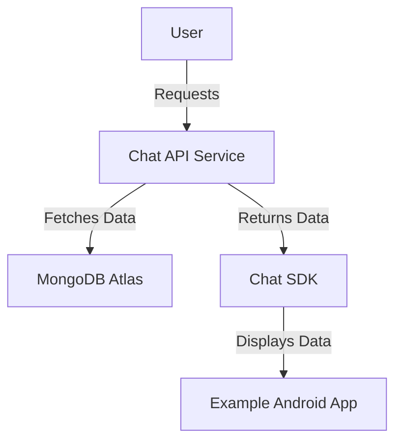

# Chat SDK Project Documentation

## Table of Contents
1. [Overview](#overview)
2. [API Service Documentation](#api-service-documentation)
    - [API Endpoints](#api-endpoints)
    - [Database Schema](#database-schema)
    - [JSON Structures](#json-structures)
    - [Setup Instructions](#setup-instructions)
    - [Error Handling](#error-handling)
3. [Android Library Documentation](#android-library-documentation)
    - [Installation](#installation)
    - [Usage Examples](#usage-examples)
    - [Callback Structure](#callback-structure)
    - [Known Limitations](#known-limitations)
4. [Android Example Application Documentation](#android-example-application-documentation)
    - [Setup Instructions](#setup-instructions-1)
    - [Usage Guide](#usage-guide)
    - [Screenshots](#screenshots)
5. [Architecture Overview](#architecture-overview)
6. [Publishing & Hosting Information](#publishing--hosting-information)
7. [License](#license)

---

## Overview
The Chat SDK project provides a complete solution for integrating chat functionality into Android applications. The project includes:

1. **Backend API Service:** RESTful API for chat, user, and message operations.
2. **Android Library:** A reusable library that interacts with the API service.
3. **Example Application:** Demonstrates the usage of the Android library.

This documentation includes setup instructions, API reference, usage examples, and more.

## Hosting & Deployment

- **API Service:** Deployed on [Koyeb](https://favourable-lorrie-yahavler-7d646b21.koyeb.app/).
   - Base URL: `https://favourable-lorrie-yahavler-7d646b21.koyeb.app/`
- **MongoDB Atlas:** Cloud-hosted database for storing chat, user, and message data.
- **Library:** Published on [JitPack](https://jitpack.io/#yahavLer/25A-10221-YahavLer-chatApp) for integration.

## Support and Maintenance

For issues, questions, or feature requests, you can:

1. **Open an Issue:** Visit the [GitHub Issues](https://github.com/yahavLer/25A-10221-YahavLer-chatApp/issues) page to report bugs or request new features.
2. **Contribute:** Fork the repository, make your changes, and submit a pull request.
3. **Contact:** For additional support, reach out to the project maintainer.

## Compatibility and Versioning

- Current Version: `1.0.0`
- Compatible with: **Android SDK 21 (Lollipop)** and above
- Library dependency: `implementation 'com.github.yahavLer:25A-10221-YahavLer-chatApp:1.0.0'`

---

## API Service Documentation

### API Endpoints
The backend API provides the following endpoints for chat, user, and message operations:

#### Chat API Endpoints
| Endpoint                             | Method | Description                                   |
|---------------------------------------|--------|-----------------------------------------------|
| `/api/chats/create`                   | POST   | Create a new chat                             |
| `/api/chats/chat/{chatId}`            | GET    | Retrieve a chat by its ID                     |
| `/api/chats/user/{userId}`            | GET    | Retrieve chats by a user ID                   |
| `/api/chats/user1/{user1Id}/user2/{user2Id}` | GET | Retrieve a chat between two users             |
| `/api/chats/all`                      | GET    | Retrieve all chats with pagination            |
| `/api/chats/delete`                   | DELETE | Delete all chats                              |

#### Message API Endpoints
| Endpoint                                 | Method | Description                                   |
|-------------------------------------------|--------|-----------------------------------------------|
| `/api/messages/send`                      | POST   | Send a new message                            |
| `/api/messages/user/{userId}/receiver/{receiverId}` | GET | Retrieve messages sent to a specific receiver |
| `/api/messages/user/{userId}/sender/{senderId}`     | GET | Retrieve messages sent from a specific sender |
| `/api/messages/{messageId}`               | GET    | Retrieve a message by its ID                  |
| `/api/messages/all`                       | GET    | Retrieve all messages with pagination         |
| `/api/messages/delete`                    | GET    | Delete all messages                           |

#### User API Endpoints
| Endpoint                                 | Method | Description                                   |
|-------------------------------------------|--------|-----------------------------------------------|
| `/api/users/create`                       | POST   | Create a new user                             |
| `/api/users/userId/{userId}`              | GET    | Retrieve a user by their ID                   |
| `/api/users/all`                          | GET    | Retrieve all users with pagination            |
| `/api/users/username/{username}/phoneNumber/{phoneNumber}` | GET | Retrieve a user by username and phone number  |

### Database Schema
The API uses a MongoDB Atlas cloud database. The main collections include:

- **Chats:** Stores chat details.
- **Users:** Stores user information.
- **Messages:** Stores chat messages.

### JSON Structures
Here are the JSON structures for key entities:

#### Chat Structure
```json
{
    "id": "chat123",
    "user1Id": "user1Id",
    "user2Id": "user2Id",
    "createdAt": "2025-01-01T12:00:00Z",
    "messages": [
        {
            "id": "message123",
            "content": "Hello World!",
            "timestamp": "2025-01-01T12:30:00Z"
        }
    ]
}
```

#### Message Structure
```json
{
    "id": "message123",
    "chatId": "chat123",
    "senderId": "user1Id",
    "receiverId": "user2Id",
    "content": "Hello World!",
    "timestamp": "2025-01-01T12:30:00Z"
}
```

#### User Structure
```json
{
    "id": "user1Id",
    "username": "john_doe",
    "phoneNumber": "+1234567890",
    "timestamp": "2025-01-01T12:00:00Z"
}
```

### Setup Instructions
1. Clone the repository.
2. Navigate to the `api-service` folder.
3. Configure the `.env` file with your MongoDB connection string.
4. Install dependencies and start the service:
    ```bash
    npm install
    npm start
    ```

### Error Handling
All endpoints return errors in the following format:
```json
{
    "error": true,
    "message": "Error description here"
}
```
Common error codes:
- `400`: Bad Request
- `404`: Resource Not Found
- `500`: Internal Server Error

---

## Android Library Documentation

### Installation
To use the library in your Android project, add the following to your `build.gradle` file:
```gradle
repositories {
    maven { url 'https://jitpack.io' }
}

dependencies {
    implementation 'com.github.yahavLer:25A-10221-YahavLer-chatApp:1.0.0'
}
```

### Usage Examples

#### 1. Creating a Chat
```java
Chat chat = new Chat();
chat.setTitle("New Chat");
chatSDK.createChat(chat, "user1Id", "user2Id", new Callback_chat<Chat>() {
    @Override
    public void onSuccess(Chat result) {
        System.out.println("Chat created with ID: " + result.getChatId());
    }

    @Override
    public void onFailure(String errorMessage) {
        System.err.println("Failed to create chat: " + errorMessage);
    }
});
```

#### 2. Sending a Message
```java
Message message = new Message();
message.setContent("Hello World!");
message.setSenderId("user1Id");
message.setReceiverId("user2Id");

chatSDK.sendMessage(message, new Callback_chat<Message>() {
    @Override
    public void onSuccess(Message result) {
        System.out.println("Message sent successfully!");
    }

    @Override
    public void onFailure(String errorMessage) {
        System.err.println("Failed to send message: " + errorMessage);
    }
});
```

#### 3. Retrieving Chats by User ID
```java
chatSDK.getChatsByUserId("user1Id", new Callback_chat<List<Chat>>() {
    @Override
    public void onSuccess(List<Chat> result) {
        System.out.println("Retrieved " + result.size() + " chats for the user.");
    }

    @Override
    public void onFailure(String errorMessage) {
        System.err.println("Failed to retrieve chats: " + errorMessage);
    }
});
```

### Callback Structure
All SDK methods use a `Callback_chat<T>` interface with two methods:
- `onSuccess(T result)`
- `onFailure(String errorMessage)`

### Known Limitations
- Media sharing (e.g., images) is not supported.
- Push notifications are not built-in.

---

## Android Example Application Documentation

### Setup Instructions
1. Clone the repository.
2. Open the `example-app` folder in Android Studio.
3. Sync the project with Gradle and run the application on an emulator or device.

### Usage Guide
- Launch the application.
- Use the provided buttons to test chat creation, user retrieval, and message sending.

---

## Architecture Overview

The system architecture is designed with the following components:

- **API Service:** Deployed on [Koyeb](https://favourable-lorrie-yahavler-7d646b21.koyeb.app/), handles all backend operations.
- **MongoDB Atlas:** Cloud-hosted database for storing chat, user, and message data.
- **Android Library:** Published on [JitPack](https://jitpack.io/#yahavLer/25A-10221-YahavLer-chatApp).
- **Example Application:** Demonstrates usage of the library's features.




---

## Publishing & Hosting Information
- **API Service:** Deployed to [Koyeb](https://www.koyeb.com/).
- **Database:** Managed with MongoDB Atlas.
- **Library:** Published to JitPack.
- **Documentation:** Available on GitHub Pages at [Project Documentation](https://your-github-pages-link).

---

## License
This project is distributed under the MIT License. See the LICENSE file for details.
